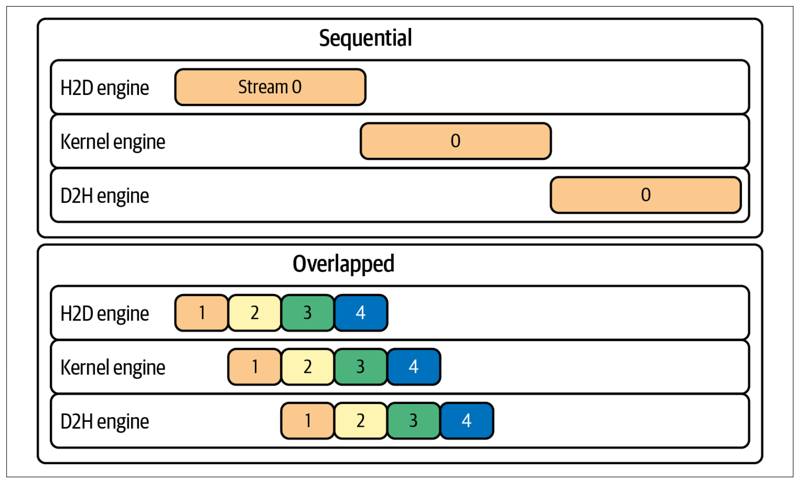
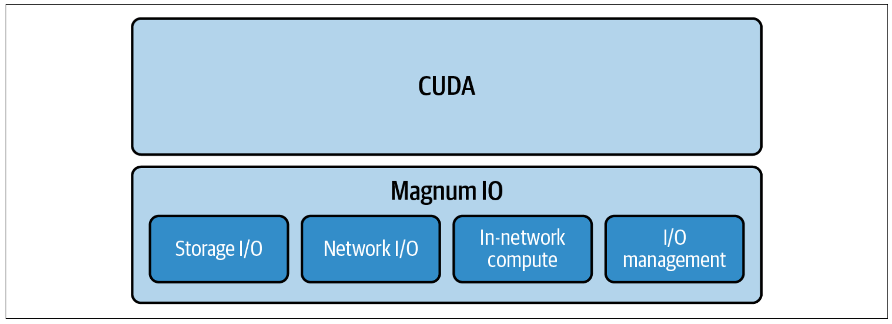
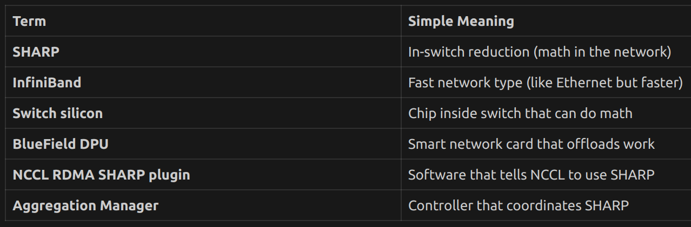
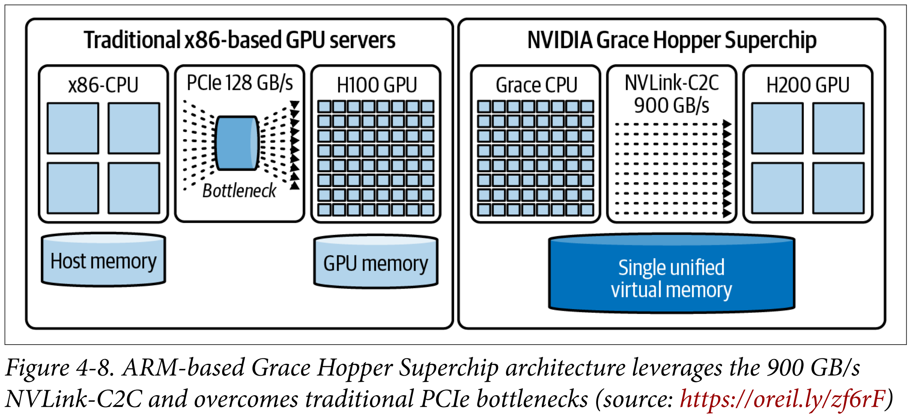

Chapter 4: Tuning Distributed Networking Communication:

- NVIDIA Magnum IO(Eg. NCCL, GPUDirect RDMA, GDS(GPU Direct Storage)) for training 
- NIXL for disaggregated inference 
- Parallel communication with computation is very important for ultrascale AI systems. 
- Overlapping Communication and Computation(Pipelining): By the time a GPU finishes one computation task, due to concurrent comms, the data for next task is already available on GPU memory. 

-Some techniques: 
    - Updates from several mini batches are combined into a single synchronization step 
    - Compression: Compress gradients --> easier to transport stuff 
    - Combine large batch sizes, gradient accumulation, asynchronous transfers, compression, and bucketing into one cohesive strategy 

Asynchronous Execution with Streams: 
- Concurrent streams enable comp||comms --> some streams do math while other streams do comms parallely 
- Perform more work per communication step can increase overlap and efficiency

- Take backprop-> nth layer gradient comp done -> parallely, call allreduce and also n-1th layer comp calculations. 
- Grad accumulation: Bad: don't all reduce for each batch, rather accumulate across batches, then do all reduce
- Compress and send gradients; sparse gradients(algo changes)

Bucketing during Backprop:
Bucketing(from PyTorch Distributed Data Parallel): Grouping many small tensors into large messages.

                    BUCKET (25MB capacity)
                    ┌─────────────────────────────┐
Layer4 done ──────► │ grad_W4 │ grad_b4 │         │ 7KB
                    ├─────────┴─────────┤         │
Layer3 done ──────► │     + grad_W3,b3  │         │ 14KB
                    ├───────────────────┤         │
Layer2 done ──────► │     + grad_W2,b2  │         │ 22KB
                    ├───────────────────┤         │
Layer1 done ──────► │     + grad_W1,b1  │ FULL!   │ 25KB
                    └───────────────────┴─────────┘
                              │
                              ▼
                    all_reduce(entire bucket)
                    ONE call instead of 8!

Large bucket: Wait for sometime but less comm overhead 
Small bucket: Faster startup time but more no. of NCCL calls 

Achieving Maximal Overlap in Practice: 

                    Layer 4 done
                         │
          ┌──────────────┴──────────────┐
          │                             │
          ▼                             ▼
    ∂L/∂W4 ready                  ∂L/∂input4 ready
          │                             │
          │                             │
          ▼                             ▼
    AllReduce(∂L/∂W4)             Layer 3 backprop
    (for W4 update)               (uses ∂L/∂input4)
          │                             │
          │                             │
          ▼                             ▼
    W4_new = W4 - η·avg           ∂L/∂W3, ∂L/∂input3
    (happens later)
    
    ◄──── THESE RUN IN PARALLEL! ────►

- Using DDP based comm + comp interleaving increased perf. by 30% --> tuning bucket size helps(25 MiB is default in Pytorch)
- Pytorch's DDP's default overlap strategy is called wait-free backpropagation(WFBP)
- Since all this happens in the background, you manually adding synchronization is bad --> don't do stuff like .item()/print/log statements as it hinders the background operations. 
- Don't also use torch.cuda.synchronize()(forces CPU to wait until all GPU ops are completed) unnecessarily

# Without sync, timing is WRONG!
start = time.time()
result = model(input)          # GPU starts work, CPU continues immediately
end = time.time()              # CPU measures, but GPU not done yet! ❌

# With sync, timing is CORRECT
start = time.time()
result = model(input)
torch.cuda.synchronize()       # Wait for GPU to finish
end = time.time()              # Now this is accurate! ✓

1/20/26:
NVIDIA Magnum I/O brings together tech to speed up data movement, access, and management across GPUs, CPUs, storage, and network interfaces. 

4 components: 
1. Storage I/O - GPU's access NVMe SSD directly; NVIDIA GPUDirect Storage(GDS), BlueField SNAP
2. Network I/O: High speed data transfer between GPU nodes bypassing CPU for internode communication; GPUDirect, RDMA, NCCL, UCS, HPC-X
3. In-Network Compute: 

AllReduce with DUMB switch:
───────────────────────────
GPU0: [1,2,3] ──────┐
GPU1: [4,5,6] ──────┼──► Switch forwards everything
GPU2: [7,8,9] ──────┤         │
GPU3: [2,3,4] ──────┘         ▼
                         All data goes to GPUs
                         GPUs compute: [14,18,22] ÷ 4
                         GPUs do the adding!

GPU 0 ────────┐
              │
GPU 1 ────────┼────► SMART Switch ────► Already reduced!
              │      (has compute)
GPU 2 ────────┤           │
              │           └── Switch ADDS the numbers
GPU 3 ────────┘               while data passes through      

4. I/O Management: Real-time telemetry, diagnostics, lifecycle management for data center's I/O fabric; NVIDIA NetQ, Uniifed Fabric Manager(UFM)

High Speed Low Overhead Data Transfers with RDMA: 
- RDMA: GPU<->GPU comms bypassing CPU --> lower latency, higher throughput, lower CPU utilization
┌─────────────────────────────────────────────────┐
│  Your Computer/Server                           │
│                                                 │
│  ┌─────┐    ┌─────┐    ┌─────┐                 │
│  │ CPU │    │ RAM │    │ GPU │                 │
│  └─────┘    └─────┘    └─────┘                 │
│      │          │          │                    │
│      └──────────┼──────────┘                    │
│                 │                               │
│           ┌─────┴─────┐                         │
│           │    NIC    │  ← Network card!        │
│           │ (Ethernet │    Connects computer    │
│           │    or     │    to the network       │
│           │InfiniBand)│                         │
│           └─────┬─────┘                         │
│                 │                               │
└─────────────────┼───────────────────────────────┘
                  │
                  ▼
            To Network / Other Servers

TRADITIONAL (with CPU):
───────────────────────

App Memory                              App Memory
    │                                       ▲
    ▼                                       │
┌───────┐                               ┌───────┐
│  CPU  │ copy to                       │  CPU  │ copy from
└───┬───┘ kernel buffer                 └───▲───┘ kernel buffer
    │                                       │
    ▼                                       │
┌───────┐                               ┌───────┐
│Kernel │                               │Kernel │
│Buffer │                               │Buffer │
└───┬───┘                               └───▲───┘
    │                                       │
    ▼                                       │
┌───────┐         Network               ┌───────┐
│  NIC  │ ════════════════════════════► │  NIC  │
└───────┘                               └───────┘

CPU involved at EVERY step! 😓
Multiple copies! Slow!

RDMA (bypass CPU):
──────────────────

App Memory                              App Memory
    │                                       ▲
    │    NIC reads directly!                │    NIC writes directly!
    ▼                                       │
┌───────┐         Network               ┌───────┐
│  NIC  │ ════════════════════════════► │  NIC  │
└───────┘                               └───────┘

CPU not involved! 🚀
Zero copies! Fast!

- Verify(Keep reverifying) and use RDMA when possible. 
- In containers, ensure container has access to the host's InfiniBand devices so that RDMA can be used -- it falls back to 10x slower TCP otherwise silently.
- Even in rdma-shared docke images, if container GID is different from host GID, it will fall back to CPU-driven RDMA not GPUDirect RDMA. 
- Checks on how to verify:
    Always verify that it is true GPUDirect RDMA. Confirm that the
    kernel module is loaded with lsmod | grep nvidia_peermem, and
    check dmesg for initialization. For an end-to-end check, run NCCL
    with NCCL_DEBUG=INFO to confirm NET/IB paths and use RDMA
    perftests with --use_cuda to validate GPU-to-GPU transfers. Veri‐
    fying will help prevent stealthy performance degradations.

- NVIDIA GPUDirect RDMA lets an RDMA-capable NIC such as Infiniband and RDAM over COnverged Ethernet(RoCE) perform direct memory access(DMA) to and from the GPU's device memory across two servers - bypassing host CPU and system RAM entirely. 

- GPUDirect RDMA latency 5-10x lower than TCP/IP over Ethernet for small messages 
- For large messages, GPUDirect RDMA IS 100s Gbps, TCP/IP <=100 Gbps, 200-400 Gbps with Ethernet RDMA

- If only ethernet available: use Ethernet RDMA, enable jumbo frames(9000 MTU) that sends few larget packets instead of many small packets --> increase throughput, lower CPU overhead.
- Best combo: High throughput + low latency 
- Tune TCP stack, verify linux sysctl params like net.core.rmem_max/wmem_max, net.ipv4.tcp_rmem/tcp_wmem are high to fully utilize a high bandwidth link. 
- Use modern TCP congestion control algorihtm to improve throughput on high latency links like CUBIC. 
- Always ensure your multinode setup is on a properly configured, high-performance, low-congestion network. Work directly with your cloud provider to understand every hop in the network architecture. 
- CPU is still involved, to setup RDMA transfers, handle communication-completion events --> Pin Network Interrupt Handling/Polling threads to a CPU core on the same NUMA Node as the NIC, ideally GPU too. 

1/21/26:

- Distributed raining requires tuning connectivity well. 

1. Understand toplogy: nvidia-smi topo -m(basic GPU interconnect)/ nvidia-smi nvlink/Nsight Systems(multihop switch fabric connectivity) || Multi-hop: hierarchy of switches
2. Leverage NVLink Switch domains if available: 

1/22/26:

LATENCY          BANDWIDTH
                   (startup)      (data flowing)
                       │                │
                       ▼                ▼
Time: ──────┬──────────┬────────────────────────────────┬──────
            │          │████████████████████████████████│
         Request    First                             Last
          sent      byte                              byte
                   arrives                           arrives
                   
            │──────────│ = Latency (delay before data starts)
                       │────────────────────────────────│ = Time to transfer
                                                          (depends on bandwidth)

| Feature      | NVLink (NVL72)           | InfiniBand (Quantum)      |
|--------------|--------------------------|---------------------------|
| Latency      | < 1µs (~hundreds of ns)  | ~1-2µs                    |
| Bandwidth    | ~130 TB/s total          | 800 Gb/s per link (~100 GB/s) |
| Scale        | 72 GPUs (one rack)       | 1000s of GPUs (cross-rack)|
| Use when     | Within same rack         | Across racks              |            

3. Use RDMA when possible --> Make sure NCCL uses GPUDirect RDMA
4. Multirail = multiple NICs working together → 2 NICs at 800 Gbps = 1.6 Tbps total
5. Direct NIC = GPU and NIC on same PCIe switch, so GPU talks to network at full speed without CPU in the way

----

PCIe = Peripheral Component Interconnect Express
It's the highway system inside your computer that connects components.

┌─────────────────────────────────────────────────────────────┐
│                      MOTHERBOARD                            │
│                                                             │
│   ┌─────┐                                                   │
│   │ CPU │ ════════════════════════════════                  │
│   └─────┘      PCIe lanes (the highways)                    │
│                    ║     ║     ║     ║                      │
│                    ║     ║     ║     ║                      │
│                 ┌──╨──┐┌─╨──┐┌─╨──┐┌─╨──┐                   │
│                 │ GPU ││NIC ││SSD ││etc │                   │
│                 └─────┘└────┘└────┘└────┘                   │
│                                                             │
└─────────────────────────────────────────────────────────────┘

What is a PCIe Lane?
Lane = one data path (like one lane on a highway)

ONE PCIe LANE:
──────────────
    ←── 1 bit at a time in each direction ──→
    
    Device A ════════════════════ Device B
              (bidirectional)

MULTIPLE LANES (x16 = 16 lanes):
────────────────────────────────
    ════════════════════  lane 1
    ════════════════════  lane 2
    ════════════════════  lane 3
    ════════════════════  ...
    ════════════════════  lane 16
    
    16 lanes working in parallel = 16x bandwidth!

Lane Width Notation
x1  = 1 lane   (slowest, for simple devices)
x4  = 4 lanes  (NVMe SSDs typically)
x8  = 8 lanes  (some NICs)
x16 = 16 lanes (GPUs, high-end NICs)

More lanes = more bandwidth

PCIe Generations (Speed per Lane)
| Generation | Speed per lane | x16 total bandwidth |
|------------|----------------|---------------------|
| PCIe Gen3  | ~1 GB/s        | ~16 GB/s            |
| PCIe Gen4  | ~2 GB/s        | ~32 GB/s            |
| PCIe Gen5  | ~4 GB/s        | ~64 GB/s            |
| PCIe Gen6  | ~8 GB/s        | ~128 GB/s           |

What is a PCIe Switch?
PCIe Switch = a traffic hub that connects multiple PCIe devices

WITHOUT PCIe Switch:
────────────────────
Everything must go through CPU!

         ┌─────┐
         │ CPU │ ← Only 64-128 PCIe lanes total
         └──┬──┘
      ┌─────┼─────┬─────┐
      │     │     │     │
     GPU   GPU   NIC   SSD
     
Problem: CPU has limited lanes!
         All traffic goes through CPU!

WITH PCIe Switch:
─────────────────
Switch expands connectivity!

         ┌─────┐
         │ CPU │ ← connects to switch with x16
         └──┬──┘
            │
      ┌─────┴─────┐
      │   PCIe    │ ← Switch has MANY ports
      │  Switch   │
      └─┬───┬───┬─┘
        │   │   │
       GPU GPU NIC
       
Benefit: Devices can talk to EACH OTHER
         through switch, not through CPU!

| Technology     | Problem       | Without                               | With                                        | Who Commands |
|----------------|---------------|---------------------------------------|---------------------------------------------|--------------|
| GPUDirect RDMA | Memory copies | GPU mem -> CPU RAM -> NIC             | GPU mem -> NIC directly (CPU tells "send")  | CPU          |
| Direct NIC     | Data path     | GPU -> Switch -> CPU -> Switch -> NIC | GPU -> Switch -> NIC                        | -            |
| IBGDA          | Command       | GPU -> CPU -> NIC (CPU tells "send")  | GPU -> NIC (GPU tells "send")               | GPU          |

1/23/26:

Multinode Communication Pitfalls:

1. Using a CPU-bound Gloo backend instead of NCCL

- Pytorch default is NCCL(GPUDirect RDMA) but sometimes it can silently fall back to Gloo(CPU+Ethernet) --> check 
- How to check: Time it --> Infiniband throughput should be 800 GB/s, check CPU utilization rate. 
- Verify backend in pytorch by calling torch.distributed.get_backend()
- In a production cluster environment with multiple NIC's, you should explicitly set NCCL_SOCKET_IFNAME=ib0 so that NCCL's initial TCP handshake runs over the InfiniBand host channel adapter(HCA).

2. Mismatched NCCL versions: Pytorch NCCL version should match system NCCL version --> silent fallback to TCP/Gloo

3. TCP port exhaustion during NCCL bootstrap: 

PORTS AND OUT-OF-BAND SETUP
===========================

Building Analogy:
-----------------
IP address      = Street address (which building/server)
Port            = Apartment number (which application)
Port range      = Available apartment numbers for guests
Ephemeral ports = Temporary guest apartments (assigned on demand)
Out-of-band     = Lobby phone calls to coordinate ("Hey, what floor are you on?")
In-band         = Actual moving of furniture (the real GPU data transfer)
Port exhaustion = No guest apartments left! New visitors can't check in.

What Happens in NCCL:
---------------------
1. BOOTSTRAP (out-of-band, TCP):
   - GPUs say hello, agree on communication order
   - Uses regular TCP with ephemeral ports
   - Each connection grabs a port from the range

2. DATA TRANSFER (in-band, RDMA/NVLink):
   - Actual gradient/tensor transfer
   - Uses high-speed interconnects

The Problem:
------------
- Port range too narrow (e.g., 50000-51000 = only 1000 ports)
- Large cluster needs many bootstrap connections
- Ports run out -> handshakes fail/stall

The Fix:
--------
Widen port range in /proc/sys/net/ipv4/ip_local_port_range
Example: 10000 65535 (gives ~55000 ports)

One-Liner:
----------
Out-of-band = TCP setup/coordination before real GPU data flows.
Each connection needs a port. Too few ports = bootstrap fails.

4. Insufficient network bandwidth or misconfigured NICs: 

SERVER A                                                    SERVER B
────────                                                    ────────

┌─────────────────────┐                          ┌─────────────────────┐
│                     │                          │                     │
│  GPU 0              │                          │  GPU 0              │
│  ┌──────────────┐   │                          │  ┌──────────────┐   │
│  │ Tensor data  │   │                          │  │              │   │
│  │ [gradients]  │   │                          │  │ [gradients]  │   │
│  └──────┬───────┘   │                          │  └──────▲───────┘   │
│         │           │                          │         │           │
│         │ GPUDirect │                          │ GPUDirect│           │
│         │ RDMA read │                          │ RDMA     │           │
│         ▼           │                          │ write    │           │
│  ┌──────────────┐   │      InfiniBand /        │  ┌───────┴──────┐   │
│  │     NIC      │═══╪══════ RoCE Network ══════╪══│     NIC      │   │
│  └──────────────┘   │                          │  └──────────────┘   │
│                     │                          │                     │
└─────────────────────┘                          └─────────────────────┘

Data path: GPU mem → NIC → Network → NIC → GPU mem
           (No CPU RAM involved!)

PITFALL #4: NETWORK BANDWIDTH / NIC CONFIGURATION
=================================================

1. CHECK:  Am I using ALL my NICs? (iftop, nload)
2. TUNE:   NCCL_SOCKET_NTHREADS, NCCL_NSOCKS_PERTHREAD
3. LIMIT:  threads × sockets ≤ 64

SYMPTOM:
- Multi-node training slower than expected
- Per-GPU throughput drops when scaling

QUICK CHECKS:
- nvidia-smi dmon     → NVLink/PCIe/Network stats
- ethtool -S <iface>  → NIC byte/packet counters
- iftop or nload      → Live NIC throughput

FIX (if you have multiple NICs):
- Enable NCCL multi-NIC support
- Set: NCCL_SOCKET_NTHREADS=2
- Set: NCCL_NSOCKS_PERTHREAD=2 (A driver can take more alternative routes if one is congested)
- Rule: threads × sockets ≤ 64

MEMORY TRICK:
- NICs = trucks
- Threads = drivers
- Sockets = routes
- More trucks + drivers = more throughput
- But too many drivers (>64) = chaos!

5. Straggler nodes or processes: 
- Slowest node determines overall speed --> monitor nodes, identify stragglers

PITFALL #5: STRAGGLER NODES
===========================

PROBLEM:
- One slow GPU/node = everyone waits
- Sync operations (AllReduce) wait for ALL ranks

CAUSES:
- Mixed hardware (different GPU types)
- Thermal throttling (GPU too hot)
- Network issues (NIC link flapping)
- Shared resources (other jobs on same node)

PREVENTION:
- Use homogeneous hardware (same GPUs everywhere)
- Dedicated cluster resources (no sharing)

DETECTION:
- DCGM: Monitor GPU health
- InfiniBand counters: Check network
- monitored_barrier: Catch slow ranks

CODE TO DETECT:
---------------
dist.monitored_barrier(timeout=datetime.timedelta(seconds=30))
# Raises error if any rank takes >30s

DEBUG ENV VARS:
---------------
NCCL_DEBUG=INFO
NCCL_ASYNC_ERROR_HANDLING=1

1. PREVENT:  Same hardware, dedicated resources
2. DETECT:   monitored_barrier(timeout=30s)
3. DEBUG:    NCCL_DEBUG=INFO to find which rank is slow

6. "PyTorch caches freed GPU memory, never returns it → fragments build up → allocation failures under RDMA"

PITFALL #6: MEMORY FRAGMENTATION (UCX/RDMA)
===========================================

PROBLEM:
- PyTorch caches freed memory (doesn't return to OS)
- Fragments accumulate over iterations
- RDMA registration pools exhausted

DETECT:
- Monitor: torch.cuda.memory_reserved() vs memory_allocated()
- If reserved >> allocated → fragmentation!

FIX (short-term):
- torch.cuda.empty_cache()  # Forces release (not ideal)

FIX (long-term):
- Upgrade CUDA runtime
- Tune PyTorch allocator settings
- Track down root cause

MONITOR CODE:
-------------
reserved = torch.cuda.memory_reserved()
allocated = torch.cuda.memory_allocated()
print(f"Reserved: {reserved/1e9:.2f}GB, Allocated: {allocated/1e9:.2f}GB")

Q4: What is UCX?
A: Unified Communication X - low-level comm library
   - Handles RDMA, shared memory, TCP
   - Can be transport layer under NCCL
   - Requires memory registration for RDMA
   - Combined with PyTorch caching = double hoarding = fragmentation!

NCCL for Distributed Multi-GPU Communication: 
- NCCL: NVIDIA Collective Communications Library -> fast comms between GPUs

| Library | Optimized For | Operations              |
|---------|---------------|-------------------------|
| NCCL    | Training      | AllReduce, Broadcast... |
| NIXL    | Inference     | Point-to-point, KV cache|

SPEED HIERARCHY (corrected):
════════════════════════════

INSIDE ONE GPU:
───────────────
HBM ─── TB/s

INSIDE NVLink DOMAIN (could span multiple trays/servers!):
──────────────────────────────────────────────────────────
NVLink/NVSwitch ─── ~900 GB/s - 1.8 TB/s
  └── NVL72: 72 GPUs across rack, ALL at NVLink speed!

OUTSIDE NVLink DOMAIN (different racks):
────────────────────────────────────────
InfiniBand ─── ~100-400 GB/s
TCP/Ethernet ─ ~1-25 GB/s

TRADITIONAL SERVER:
───────────────────
- Has its own CPU(s)
- Has its own RAM
- Has its own storage
- Has its own OS
- Fully independent computer
- GPUs are "attached" to it

NVL72 TRAY (Compute Module):
────────────────────────────
- Contains GPUs (+ Grace CPUs in GB200)
- NOT a standalone server
- Part of a unified RACK system
- GPUs connected via NVSwitch backplane
- Shared infrastructure at rack level

Traditional Setup:
──────────────────
┌─────────┐   ┌─────────┐   ┌─────────┐
│ Server1 │   │ Server2 │   │ Server3 │    ← Independent computers
│ 8 GPUs  │   │ 8 GPUs  │   │ 8 GPUs  │
└────┬────┘   └────┬────┘   └────┬────┘
     │             │             │
     └─────── InfiniBand ────────┘         ← Separate network
     
Each server is a standalone computer.
GPUs in different servers = slower interconnect.

NVL72 Setup:
────────────
┌───────────────────────────────────────────────────────────────────┐
│                    ONE INTEGRATED RACK SYSTEM                     │
│                                                                   │
│   ┌─────────┐   ┌─────────┐   ┌─────────┐                        │
│   │ Tray 1  │   │ Tray 2  │   │ Tray 3  │ ...                    │
│   │(module) │   │(module) │   │(module) │     ← Just "drawers"   │
│   │ 8 GPUs  │   │ 8 GPUs  │   │ 8 GPUs  │       in the rack      │
│   └────┬────┘   └────┬────┘   └────┬────┘                        │
│        │             │             │                              │
│        └─────────────┴─────────────┘                              │
│                      │                                            │
│               NVSwitch Backplane      ← Built into rack!          │
│              (all trays plug into)                                │
│                                                                   │
└───────────────────────────────────────────────────────────────────┘

Trays are like DRAWERS in a filing cabinet.
The cabinet (rack) has the NVSwitch built in.

┌─────────────────────────────────────────────────────────────────┐
│                      GB200 NVL72 RACK                           │
│                                                                 │
│   Compute Tray contains:                                        │
│   ┌───────────────────────────────────────────────────────┐     │
│   │                                                       │     │
│   │  Grace CPU ──┬── B200 GPU  │  ← 1 "superchip"         │     │
│   │              └── B200 GPU  │    (1 CPU + 2 GPUs)      │     │
│   │                            │                          │     │
│   │  Grace CPU ──┬── B200 GPU  │  ← Another superchip     │     │
│   │              └── B200 GPU  │    (1 CPU + 2 GPUs)      │     │
│   │                                                       │     │
│   │         2 superchips per tray = 4 GPUs per tray       │     │
│   │                                                       │     │
│   └───────────────────────────────────────────────────────┘     │
│                                                                 │
│   18 trays × 4 GPUs = 72 GPUs total ✓                           │
│                                                                 │
│   All 72 GPUs ◄═════ NVSwitch Backplane ═════► All 72 GPUs      │
│                                                                 │
└─────────────────────────────────────────────────────────────────┘

1/24/26:
Topology Awareness in NCCL: 
1. An interconnect is simply a communication pathway between computing components.
NVLink: High speed point-to-point link, connects two devices directly
NVSwitch: A switch chip that connects multiple NVLinks together
- 1 GPU-Switch is NVLink and switch connects to multiple GPU providing ~900GB/s bw
Without NVSwitch:          With NVSwitch:
                           
  A ─── B                      A   B
  │╲   ╱│                       \ │ /
  │ ╲ ╱ │                        \│/
  │ ╱ ╲ │                    ────[HUB]────
  │╱   ╲│                        /│\
  C ─── D                       / │ \
                               C   D
  (28 links for 8 GPUs)    (8 links + switch)

- NCCL has algorithms that optimize given topology info. 
- Interswitch Link: Connection between two switches. 
- To debug: see Nsight systems, NCCL traces -> see bandwidth info -> check for PCIe OOM transfer speeds. 
- Check that the most optimal links are used frequently.
- CPU-GPU interconnects in Grace Blackwell Superchip using NVLink-C2C is 900 GB/s -- this allows the CPU memory to act as a high-speed extension of GPU memory. 

Single GPU (Blackwell):
┌─────────────────────────────────┐
│           GPU                   │
│                                 │
│  Link1  Link2  ... Link18      │  ← 18 physical NVLink ports
│    │      │          │          │
└────┼──────┼──────────┼──────────┘
     ↓      ↓          ↓
   To other GPUs/switches
   
18 links × 100 GB/s = 1.8 TB/s total bandwidth (per GPU)

NVL72 = 72 GPUs + 36 CPUs (Grace) in one system

┌──────────────────────────────────────────────────┐
│                   NVL72 Rack                     │
│                                                  │
│   ┌─────────┐ ┌─────────┐     ┌─────────┐       │
│   │ Grace   │ │ Grace   │ ... │ Grace   │  ×36  │
│   │  CPU    │ │  CPU    │     │  CPU    │       │
│   └────┬────┘ └────┬────┘     └────┬────┘       │
│        │           │               │             │
│   ┌────┴────┐ ┌────┴────┐     ┌────┴────┐       │
│   │Blackwell│ │Blackwell│     │Blackwell│       │
│   │  GPU    │ │  GPU    │ ... │  GPU    │  ×72  │
│   └────┬────┘ └────┬────┘     └────┬────┘       │
│        │           │               │             │
│        └───────────┴───── NVLink ──┴─────       │
│              (via NVSwitches)                    │
└──────────────────────────────────────────────────┘

- Tools to use:
    - NVIDIA Nsight Systems
    - NCCL's own traces with NCCL_DEBU=INFO and NCCL_TOPO_DUMP_FILE=<path> will show if NVLink paths are being utilized fully. 

- NCCL Internal algorithms: Ring, Tree, CollNet, and Parallel Aggregated Tree (PAT)

- Ring: Each GPU sends data to the next GPU in a circular manner, some kind of aggregation happening. 
✅ Bandwidth: Every link sends exactly 2×(data/N) 
❌ Latency:   Must hop through ALL GPUs

- Tree and NVLSTree: The aggregation uses some kind of a tree structure and can do all-reduce in O(log(N GPU's)) compared to O(N) in ring -> uses NVLing SHARP offload --> latency-dominated workload. 

- CollTree(hierarchical tree collectives):
    - Hierarchical 2 trees, local trees in fast NVLink domains, then a global tree across domains.
    - Compared to flat ring O(N), no. of cross node steps to O(logN)
WITHOUT NVLink SHARP:                 WITH NVLink SHARP:

   GPU0   GPU1   GPU2   GPU3            GPU0   GPU1   GPU2   GPU3
     │      │      │      │               │      │      │      │
     ▼      ▼      ▼      ▼               ▼      ▼      ▼      ▼
   ┌──────────────────────┐            ┌──────────────────────┐
   │      NVSwitch        │            │  NVSwitch + SHARP    │
   │   (just routing)     │            │  ┌────────────────┐  │
   └──────────────────────┘            │  │ SUM: a+b+c+d   │  │
             │                          │  └────────────────┘  │
             ▼                          └──────────┬───────────┘
   GPU 0 receives all data                         │
   GPU 0 does: a+b+c+d                             ▼
   GPU 0 sends result back              All GPUs receive FINAL SUM
                                        (no GPU math needed!)
   Steps: receive, compute, send        Steps: just receive!

- SHARP enables the switch to do the math so the GPU's focus on heavy math. 
- SHARP = Scalable Hierarchical Aggregation and Reduction Protocol
- On NVLink domains, the local tree is routed over NVSwithch and can use NVLink SHARP for in-switch aggregation when available. 
- Ring or PAT may achieve higher peak throughput while CollTree is preferred when cross node latency dominates. 

"Fabric" = mesh of switches and cables connecting everything

         ┌──────────┐     ┌──────────┐     ┌──────────┐
         │  Rack 0  │     │  Rack 1  │     │  Rack 2  │
         │  NVL72   │     │  NVL72   │     │  NVL72   │
         └────┬─────┘     └────┬─────┘     └────┬─────┘
              │                │                │
              ▼                ▼                ▼
         ┌─────────────────────────────────────────────┐
         │           InfiniBand Fabric                 │
         │    (Switches + Cables connecting racks)     │
         │         ~400-800 Gb/s per link              │
         └─────────────────────────────────────────────┘
                              ▲
                    "Scale-out" network
              (slower than NVLink, but connects MANY racks)

CollNet(hierarchical collectives across nodes):

CollNet = CollNet = Reduce locally first (fast NVLink), then only leaders talk across nodes (minimize slow traffic) -> Low latency for internode transfers and high bandwidth for intranode traffic. 

Parallel Aggregated Tree(PAT):
- Ring + Tree algorithms
- Near ring level throughput for large data transfers + tree-level latency advantages for smaller segments. 

- Which algorithm to chose?
1. Message size and topology -> small messages use tree algorithms and large messages use ring algorithms 
2. NVSwitch's hardware multicast for one-hop broadcasts: GPU sends data once → NVSwitch copies it to all 71 other GPUs simultaneously. Fastest possible broadcast! 🚀
3. To manually set the algorithm, before calling ncclCommInitRank(), set NCCL_ALGO environment variable:
   - NCCL_ALGO=RING
   - NCCL_ALGO=TREE
   - NCCL_ALGO=COLLNET
   - NCCL_ALGO=PAT

1/25/26:
- Gradient accumulation/activation check-pointing/data parallel/tensor model parallel/pipeline parallel/expert parallel/context parallel, etc. 
- Pytorch offers data parallel and model parallel frameworks. 
- 2 types of data parallel
1. DataParallel (single node/python process, multi GPU) - uses torch.nn.DataParallel - 1 Python process deals with distributing/aggregating stuff among multiple GPUs but the GPU coordination is GIL-bound and hence almost sequential

- 1 Eg. The controller python thread has management overhead, and also gradient aggregation isn't overlapped with ongoing computation on GPU's. 

2. Fully Sharded Data Parallelism(FSDP): 

Sharding: Splitting data into pieces distributed across GPU's. 

FSDP: Instead of each GPU holding full model copy, shard (split) weights/gradients/activations across GPUs — gather temporarily when needed, discard after — saves memory, enables larger models.

3. DistributedDataParallel(DDP): 1 process per GPU, multi process-GPU's combos -- uses NCCL to comm. grads -- each process has its own copy of the model. 
- Almost always use DDP for multi-GPU training. 

NCCL Communicator Lifecycle and Environment Gotchas: 

Pitfall P1: CREATING Nccl COMMUNICATORS TOO OFTEN: 
- NCCL communicator represents a group of GPUs, or ranks, that can communicate collectively -> Creating a communicator has overhead -- reduce it. 
- PyTorch DDP handles the communicator for you. 
- Initialize NCCL communicators only once per group of GPUs. 
 
1/26/26: 
P2: Even for subgroups, donot create sub communicators -> just create once and reuse. 
- For cases like dynamic runtime membership scenario/staged initilization, NCCL provides C++ API to initialize multiple communicators together using ncclGroupStart(), ncclCommInitRank(), and ncclGroupEnd(). 

Dynamic Runtime Membership
= GPUs joining/leaving during training

TIME ──────────────────────────────────────────►

Start:     [GPU0] [GPU1] [GPU2] [GPU3]
                     │
           Training running...
                     │
Node fails:    ✗     │
           [GPU0]   [GPU2] [GPU3]    ← GPU1 died!
                     │
Node joins:          │
           [GPU0] [GPU4] [GPU2] [GPU3]  ← GPU4 joined!
           
Need to recreate communicator with new members!

You want to add a new GPU to a group of GPU's --> NCCL communicator is destroyed and recreated (full restart), not dynamically modified. There's no "add a GPU" API; you rebuild the whole group.

P4: Avoid overtuning or disabling NCCL features with environment vars. 
- NCCL_BUFFSIZE -> high -> memory based problem -> increase step wise
- Defaults are good, don't forget to get back things in production after debug mode. 
- NCCL_P2P_DISABLE=1-> intranode traffic through CPU not GPUDirect -> slow
- NCCL_SHM_DISABLE=1 -> disables shared memory for intranode comms -> slow

Shared memory lets processes on the same node exchange data via direct RAM access (no kernel/network), reducing latency and overhead for intranode NCCL communication.

- NCCL_DEBUG=INFO -> verbose logging, slow/usually set to WARN in production

Helpful flags: 
NCCL_NSOCKS_PERTHREAD and NCCL_SOCKET_NTHREADS: 
│   Threads = WORKERS (CPU cores handling connections)    │
│   Sockets = PIPES (actual data connections)             │
│                                                         │
│   More pipes = more parallel data                       │
│   More workers = handle more pipes efficiently          │
│   But too many = overhead > benefit (cap at 64)         │

Sockets = parallel network connections; threads = workers managing them. More of each = higher throughput, but NCCL caps at 64 total (threads × sockets) to avoid CPU/OS overload.

2 pages in 30 mins speed :,(

- NCCL_MIN_NCHANNELS and NCCL_MAX_NCHANNELS: Keep them unchanged 
┌─────────────────────────────────────────────────────────┐
│                                                         │
│  Ring     = circular path data travels                  │
│  Channel  = 1 ring + 1 CUDA block + 1 set of NVLinks    │
│  Multiple channels = parallel rings using all NVLinks   │
│                                                         │
│  NCCL_MIN_NCHANNELS: minimum parallel rings             │
│  NCCL_MAX_NCHANNELS: maximum parallel rings             │
│                                                         │
│  Trade-off:                                             │
│    More channels → more bandwidth (use all NVLinks)     │
│    More channels → more GPU resources consumed          │
│                                                         │
└─────────────────────────────────────────────────────────┘
- NCCL_TOPO_FILE = feed NCCL a topology map when auto-detection fails (complex/cloud setups); use NCCL_TOPO_DUMP_FILE to see what NCCL auto-detected.

Normal NVLink = GPU-to-GPU within one rack/chassis; MNNVL = extends NVLink fabric across multiple racks so inter-rack communication stays at NVLink speed instead of falling back to InfiniBand.(Eg. NVL72 GB200/GB300)

- NCCL_MNNVL_ENABLE: NVIDIA multi-node NVLink designed for high-speed communication 

MOST SETUPS (what you're thinking):
───────────────────────────────────

Within rack:     NVLink      (~1.8 TB/s)
Across racks:    InfiniBand  (~400 GB/s)  ✓ You're correct!

SPECIAL MNNVL SETUPS (rare, cutting-edge):
──────────────────────────────────────────

Within rack:     NVLink      (~1.8 TB/s)
Across racks:    ALSO NVLink (~1.8 TB/s)  ← requires special hardware!

- NCCL_SHARP_DISABLE=1: Disables NVLink SHARP offload in switches; usually leave enabled for best performance.

Pitfall 4: Verify CPU-GPU NUMA node affinity for NCCL threads: 
- Bind each GPU process to the CPU cores for its NUMA domain
- Set NCCL_IGNORE_CPU_AFFINITY = 1 so that NCCL can fine-tune thread placement within those cores

- NCCL spans threads for comm management ->thread needs to attach to a core, if process is pinned to a core in a different NUMA node than the GPU, performance degrades -> thread is managing GPU comms but is on a CPU core far away (high latency) -> slows everything down.

- Good practice: Use numactl/set CUDA_DEVICE_ORDER/CUDA_VISIBLE_DEVICES can enforce this binding. 

P5: Resist the temptation to ignore NCCL warnings and errors: 
- "Unable to enable P2P, falling back to copy"

┌────────────────────────────────────────────────────────┐
│                   ONE SERVER                           │
│                                                        │
│   ┌─────────┐          ┌─────────┐                    │
│   │ CPU 0   │──QPI/UPI─│ CPU 1   │                    │
│   │ (Root 0)│          │ (Root 1)│                    │
│   └────┬────┘          └────┬────┘                    │
│        │                    │                          │
│   GPU0 GPU1 GPU2 GPU3  GPU4 GPU5 GPU6 GPU7            │
│     │    │    │    │     │    │    │    │             │
│     └────┴────┴────┴─────┴────┴────┴────┘             │
│                    NVSwitch                            │
│              (bypasses PCIe mess)                      │
└────────────────────────────────────────────────────────┘

PCIe P2P: Limited by root complex boundaries
NVLink:   Doesn't care, direct GPU↔GPU

TYPICAL AI SERVER (e.g., DGX A100, HGX H100):
─────────────────────────────────────────────

┌─────────────────────────────────────────────────────┐
│                  ONE MACHINE                        │
│                                                     │
│    CPU 0 (Socket 0)         CPU 1 (Socket 1)       │
│   ┌─────────────┐          ┌─────────────┐         │
│   │Root Complex │          │Root Complex │         │
│   │      0      │◄──QPI───►│      1      │         │
│   └──────┬──────┘          └──────┬──────┘         │
│          │                        │                 │
│    ┌─────┼─────┐            ┌─────┼─────┐          │
│    │     │     │            │     │     │          │
│  GPU0  GPU1  GPU2  GPU3   GPU4  GPU5  GPU6  GPU7   │
│    └─────┴─────┘            └─────┴─────┘          │
│     Root Complex 0           Root Complex 1        │
│                                                     │
└─────────────────────────────────────────────────────┘

8 GPUs, 1 machine, but 2 root complexes!

GPU 0 ↔ GPU 3: Same root complex → P2P works ✓
GPU 0 ↔ GPU 5: Different root complexes → P2P may fail ✗

WITHOUT NVLink:
───────────────
GPU 0 ↔ GPU 5 (different root complexes)
  → PCIe P2P blocked
  → Falls back to CPU memory copy (slow!)

WITH NVLink:
────────────
GPU 0 ═══NVLink═══ GPU 5
  → Bypasses PCIe entirely
  → Direct GPU-to-GPU (fast!)

WITH NVSwitch:
──────────────
All 8 GPUs ═══ NVSwitch ═══ All 8 GPUs
  → Every GPU can talk to every GPU
  → Don't care about root complexes anymore!

Intra-node ≠ same root complex — multi-socket servers have multiple CPUs, each with its own root complex. GPUs attached to different CPUs may fail PCIe P2P. That's why NVLink exists — to bypass PCIe limitations entirely!

Multi-socket = one server with multiple CPU chips (sockets); each socket has its own root complex. This is within a single node/server, not a separate level in the hierarchy. High-end AI servers (DGX, HGX) are typically dual-socket.

DATA CENTER
    │
    └── RACK (cabinet holding servers)
           │
           └── SERVER / NODE (one computer)
                  │
                  ├── SOCKET 0 (CPU 0 + Root Complex 0)
                  │      │
                  │      └── PCIe devices (GPUs 0-3, NIC, etc.)
                  │
                  └── SOCKET 1 (CPU 1 + Root Complex 1)
                         │
                         └── PCIe devices (GPUs 4-7, NIC, etc.)

TRADITIONAL (4 servers in a rack):
──────────────────────────────────

┌─────────────────────────────────────────┐
│                RACK                      │
│  ┌─────────────────────────────────┐    │
│  │ Server 0 (standalone computer)  │    │
│  │   CPU + RAM + Storage + 8 GPUs  │    │
│  └─────────────────────────────────┘    │
│  ┌─────────────────────────────────┐    │
│  │ Server 1 (standalone computer)  │    │
│  │   CPU + RAM + Storage + 8 GPUs  │    │
│  └─────────────────────────────────┘    │
│  ┌─────────────────────────────────┐    │
│  │ Server 2 (standalone computer)  │    │
│  │   CPU + RAM + Storage + 8 GPUs  │    │
│  └─────────────────────────────────┘    │
│                                         │
│  Servers connected via InfiniBand       │
│  (separate network)                     │
└─────────────────────────────────────────┘

32 GPUs across 4 independent servers
GPU 0↔GPU 8 = InfiniBand (slow)

NVL72 (18 trays in a rack):
───────────────────────────

┌─────────────────────────────────────────┐
│              NVL72 RACK                 │
│         (ONE unified computer)          │
│                                         │
│  ┌───┐ ┌───┐ ┌───┐ ┌───┐ ... (×18)     │
│  │T0 │ │T1 │ │T2 │ │T3 │               │
│  │4G │ │4G │ │4G │ │4G │               │
│  └─┬─┘ └─┬─┘ └─┬─┘ └─┬─┘               │
│    │     │     │     │                  │
│    └─────┴─────┴─────┘                  │
│           │                             │
│     NVSwitch Fabric                     │
│   (built into rack)                     │
└─────────────────────────────────────────┘

72 GPUs in ONE system
GPU 0↔GPU 71 = NVLink (fast!)

┌────────────────────────────────────────────────────────────────────────────┐
│                              NVL72 RACK                                    │
│                                                                            │
│    ┌─────────────────────────────────────────────────────────────────┐    │
│    │                        NVSwitch Fabric                           │    │
│    │                    (ALL 72 GPUs connected)                       │    │
│    │                        NVLink: 1.8 TB/s                          │    │
│    └───────────────────────────────┬─────────────────────────────────┘    │
│                                    │                                       │
│         ┌──────────────────────────┼──────────────────────────┐           │
│         │                          │                          │           │
│         ▼                          ▼                          ▼           │
│    ┌─────────┐                ┌─────────┐                ┌─────────┐      │
│    │  B200   │                │  B200   │                │  B200   │      │
│    │  GPU    │                │  GPU    │                │  GPU    │      │
│    └────┬────┘                └────┬────┘                └────┬────┘      │
│         │ NVLink-C2C               │                          │           │
│         │ 900 GB/s                 │                          │           │
│         ▼                          ▼                          ▼           │
│    ┌─────────┐                ┌─────────┐                ┌─────────┐      │
│    │  Grace  │                │  Grace  │                │  Grace  │      │
│    │  CPU    │                │  CPU    │                │  CPU    │      │
│    └────┬────┘                └─────────┘                └─────────┘      │
│         │ PCIe Gen5                                                       │
│         │ ~64 GB/s                                                        │
│         ▼                                                                 │
│    ┌─────────┐                                                            │
│    │   NIC   │ ◄─── GPUDirect RDMA (GPU↔NIC bypasses CPU)                │
│    │ (CX-7)  │                                                            │
│    └────┬────┘                                                            │
│         │                                                                 │
└─────────┼─────────────────────────────────────────────────────────────────┘
          │
          │ InfiniBand (400-800 Gb/s)
          │    or
          │ MNNVL (1.8 TB/s, if equipped)
          │
          ▼
    ┌───────────┐
    │Other Racks│
    └───────────┘

Traditional Data Center (with NUMA)
┌─────────────────────────────────────────────────────────────────────────────┐
│                              DATA CENTER                                    │
│                        (Building / Campus)                                  │
├─────────────────────────────────────────────────────────────────────────────┤
│                                                                             │
│   ┌─────────────────────────────────────────────────────────────────────┐  │
│   │                             POD                                      │  │
│   │              (Group of racks, shared power/cooling)                  │  │
│   │                    Connected via: Spine Switches                     │  │
│   ├─────────────────────────────────────────────────────────────────────┤  │
│   │                                                                      │  │
│   │   ┌───────────────────────────────────────────────────────────┐     │  │
│   │   │                         RACK                               │     │  │
│   │   │                  (Physical cabinet, 42U)                   │     │  │
│   │   │               Connected via: Leaf Switches                 │     │  │
│   │   │                   (InfiniBand ~400 GB/s)                   │     │  │
│   │   ├───────────────────────────────────────────────────────────┤     │  │
│   │   │                                                            │     │  │
│   │   │   ┌─────────────────────────────────────────────────┐     │     │  │
│   │   │   │              SERVER / NODE                       │     │     │  │
│   │   │   │           (One computer unit)                    │     │     │  │
│   │   │   │       Connected via: InfiniBand (~400 GB/s)      │     │     │  │
│   │   │   ├─────────────────────────────────────────────────┤     │     │  │
│   │   │   │                                                  │     │     │  │
│   │   │   │   ┌───────────────────────────────────────┐     │     │     │  │
│   │   │   │   │           NUMA NODE 0                  │     │     │     │  │
│   │   │   │   │     (Socket 0 + local resources)       │     │     │     │  │
│   │   │   │   │  Connected to NUMA 1: QPI/UPI ~50 GB/s │     │     │     │  │
│   │   │   │   ├───────────────────────────────────────┤     │     │     │  │
│   │   │   │   │                                        │     │     │     │  │
│   │   │   │   │   ┌─────────────────────────────┐     │     │     │     │  │
│   │   │   │   │   │   CPU SOCKET 0               │     │     │     │     │  │
│   │   │   │   │   │   (Root Complex 0)           │     │     │     │     │  │
│   │   │   │   │   │   Cores, L3 Cache            │     │     │     │     │  │
│   │   │   │   │   └─────────────────────────────┘     │     │     │     │  │
│   │   │   │   │                                        │     │     │     │  │
│   │   │   │   │   ┌─────────────────────────────┐     │     │     │     │  │
│   │   │   │   │   │   LOCAL RAM                  │     │     │     │     │  │
│   │   │   │   │   │   (DDR5, ~512GB)             │     │     │     │     │  │
│   │   │   │   │   │   ~300 GB/s to local CPU     │     │     │     │     │  │
│   │   │   │   │   └─────────────────────────────┘     │     │     │     │  │
│   │   │   │   │                                        │     │     │     │  │
│   │   │   │   │   ┌─────────────────────────────┐     │     │     │     │  │
│   │   │   │   │   │   GPUs 0-3                   │     │     │     │     │  │
│   │   │   │   │   │   (PCIe Gen5 ~64 GB/s each)  │     │     │     │     │  │
│   │   │   │   │   │   GPU↔GPU: NVLink ~900 GB/s  │     │     │     │     │  │
│   │   │   │   │   └─────────────────────────────┘     │     │     │     │  │
│   │   │   │   │                                        │     │     │     │  │
│   │   │   │   │   ┌─────────────────────────────┐     │     │     │     │  │
│   │   │   │   │   │   NIC 0                      │     │     │     │     │  │
│   │   │   │   │   │   (PCIe ~64 GB/s to CPU)     │     │     │     │     │  │
│   │   │   │   │   │   GPUDirect RDMA to GPU      │     │     │     │     │  │
│   │   │   │   │   └─────────────────────────────┘     │     │     │     │  │
│   │   │   │   │                                        │     │     │     │  │
│   │   │   │   └───────────────────────────────────┘     │     │     │     │  │
│   │   │   │                                                  │     │     │  │
│   │   │   │   ┌───────────────────────────────────────┐     │     │     │  │
│   │   │   │   │           NUMA NODE 1                  │     │     │     │  │
│   │   │   │   │     (Socket 1 + local resources)       │     │     │     │  │
│   │   │   │   ├───────────────────────────────────────┤     │     │     │  │
│   │   │   │   │   (Same structure: CPU, RAM,           │     │     │     │  │
│   │   │   │   │    GPUs 4-7, NIC 1)                    │     │     │     │  │
│   │   │   │   └───────────────────────────────────────┘     │     │     │  │
│   │   │   │                                                  │     │     │  │
│   │   │   │   ┌───────────────────────────────────────┐     │     │     │  │
│   │   │   │   │           NVSwitch (if present)        │     │     │     │  │
│   │   │   │   │   Connects GPUs 0-7 at NVLink speed    │     │     │     │  │
│   │   │   │   │   (~900 GB/s per GPU, all-to-all)      │     │     │     │  │
│   │   │   │   └───────────────────────────────────────┘     │     │     │  │
│   │   │   │                                                  │     │     │  │
│   │   │   └─────────────────────────────────────────────┘     │     │  │
│   │   │                                                            │     │  │
│   │   └───────────────────────────────────────────────────────────┘     │  │
│   │                                                                      │  │
│   └─────────────────────────────────────────────────────────────────────┘  │
│                                                                             │
└─────────────────────────────────────────────────────────────────────────────┘
NVL72 Data Center (GB200/GB300)
┌─────────────────────────────────────────────────────────────────────────────┐
│                              DATA CENTER                                    │
│                        (Building / Campus)                                  │
├─────────────────────────────────────────────────────────────────────────────┤
│                                                                             │
│   ┌─────────────────────────────────────────────────────────────────────┐  │
│   │                             POD                                      │  │
│   │              (Group of NVL72 racks, shared power/cooling)            │  │
│   │                                                                      │  │
│   │              Rack↔Rack: InfiniBand (~400 GB/s)                       │  │
│   │                    OR: MNNVL (~1.8 TB/s) if equipped                 │  │
│   ├─────────────────────────────────────────────────────────────────────┤  │
│   │                                                                      │  │
│   │   ┌───────────────────────────────────────────────────────────┐     │  │
│   │   │                    NVL72 RACK                              │     │  │
│   │   │           (THE RACK IS THE COMPUTER)                       │     │  │
│   │   │            72 GPUs, 36 CPUs, unified                       │     │  │
│   │   │                                                            │     │  │
│   │   │   Total Fabric BW: ~130 TB/s                               │     │  │
│   │   │   Any GPU↔GPU: ~1.8 TB/s (NVLink 5.0)                      │     │  │
│   │   ├───────────────────────────────────────────────────────────┤     │  │
│   │   │                                                            │     │  │
│   │   │   ┌─────────────────────────────────────────────────┐     │     │  │
│   │   │   │              NVSwitch BACKPLANE                  │     │     │  │
│   │   │   │      (Built into rack, connects ALL 72 GPUs)     │     │     │  │
│   │   │   │           All-to-all @ 1.8 TB/s per GPU          │     │     │  │
│   │   │   │                                                  │     │     │  │
│   │   │   │   GPU 0 ══╗     ╔══ GPU 35                       │     │     │  │
│   │   │   │   GPU 1 ══╬═════╬══ GPU 36                       │     │     │  │
│   │   │   │    ...   ══╬═════╬══  ...                        │     │     │  │
│   │   │   │   GPU 34 ══╝     ╚══ GPU 71                      │     │     │  │
│   │   │   │                                                  │     │     │  │
│   │   │   └───────────────────────┬─────────────────────────┘     │     │  │
│   │   │                           │                                │     │  │
│   │   │         ┌─────────────────┼─────────────────┐             │     │  │
│   │   │         │                 │                 │             │     │  │
│   │   │         ▼                 ▼                 ▼             │     │  │
│   │   │   ┌───────────┐    ┌───────────┐    ┌───────────┐        │     │  │
│   │   │   │COMPUTE    │    │COMPUTE    │    │COMPUTE    │  ×18   │     │  │
│   │   │   │TRAY 0     │    │TRAY 1     │    │TRAY 17    │ trays  │     │  │
│   │   │   │(module)   │    │(module)   │    │(module)   │        │     │  │
│   │   │   ├───────────┤    ├───────────┤    ├───────────┤        │     │  │
│   │   │   │           │    │           │    │           │        │     │  │
│   │   │   │ ┌───────┐ │    │           │    │           │        │     │  │
│   │   │   │ │SUPER- │ │    │  (same    │    │  (same    │        │     │  │
│   │   │   │ │CHIP 0 │ │    │ structure)│    │ structure)│        │     │  │
│   │   │   │ ├───────┤ │    │           │    │           │        │     │  │
│   │   │   │ │Grace  │◄──NVLink-C2C──►│           │    │           │        │     │  │
│   │   │   │ │CPU    │ │    │  900 GB/s │    │           │        │     │  │
│   │   │   │ │       │ │    │           │    │           │        │     │  │
│   │   │   │ └───┬───┘ │    │           │    │           │        │     │  │
│   │   │   │     │     │    │           │    │           │        │     │  │
│   │   │   │ ┌───┴───┐ │    │           │    │           │        │     │  │
│   │   │   │ │B200   │ │    │           │    │           │        │     │  │
│   │   │   │ │GPU ×2 │═╪════╪═══════════╪════╪═══════════╪══ NVLink to    │  │
│   │   │   │ │       │ │    │           │    │           │   NVSwitch     │  │
│   │   │   │ └───────┘ │    │           │    │           │   (1.8 TB/s)   │  │
│   │   │   │           │    │           │    │           │        │     │  │
│   │   │   │ ┌───────┐ │    │           │    │           │        │     │  │
│   │   │   │ │SUPER- │ │    │           │    │           │        │     │  │
│   │   │   │ │CHIP 1 │ │    │           │    │           │        │     │  │
│   │   │   │ │(same) │ │    │           │    │           │        │     │  │
│   │   │   │ └───────┘ │    │           │    │           │        │     │  │
│   │   │   │           │    │           │    │           │        │     │  │
│   │   │   │ ┌───────┐ │    │           │    │           │        │     │  │
│   │   │   │ │ NIC   │◄─────PCIe Gen5──────►│           │        │     │  │
│   │   │   │ │(CX-7) │ │    │  ~64 GB/s │    │           │        │     │  │
│   │   │   │ └───┬───┘ │    │           │    │           │        │     │  │
│   │   │   │     │     │    │           │    │           │        │     │  │
│   │   │   └─────┼─────┘    └───────────┘    └───────────┘        │     │  │
│   │   │         │                                                 │     │  │
│   │   │         │ GPUDirect RDMA (GPU↔NIC bypasses CPU)          │     │  │
│   │   │         │                                                 │     │  │
│   │   │         ▼                                                 │     │  │
│   │   │   ┌───────────────────────────────────────────────┐      │     │  │
│   │   │   │              INFINIBAND / MNNVL               │      │     │  │
│   │   │   │         (To other racks in the pod)           │      │     │  │
│   │   │   │                                               │      │     │  │
│   │   │   │   InfiniBand: ~400 GB/s (standard)            │      │     │  │
│   │   │   │   MNNVL:      ~1.8 TB/s (optional upgrade)    │      │     │  │
│   │   │   └───────────────────────────────────────────────┘      │     │  │
│   │   │                                                            │     │  │
│   │   └───────────────────────────────────────────────────────────┘     │  │
│   │                                                                      │  │
│   └─────────────────────────────────────────────────────────────────────┘  │
│                                                                             │
└─────────────────────────────────────────────────────────────────────────────┘

1/27/26:
- NCCL INFO NET/Socket: using Ethernet interfact eth0- tells which interface was picked
- To set to highest performing interconnect, use NCCL_SOCKET_IFNAME = ib0

Pitfall : NCCL communicator hangs, errors, or shuts down completely: 
- If one GPU in one rank fails, the whole communicator fails due to collectives not being able to complete tasks. 
- NCCL_ASYNC_ERROR_HANDLING = 1(usually default, check once)
- NCCL comm engine improves with versions, check affinities, environment vars, etc. 

Profiling and Debugging NCCL: 
- NCCL_ASYNC_ERROR_HANDLING=1
- NCCL_DEBUG=WARN or INFO
- NCCL_PROFILER_PLUGIN interface -- monitor internal timeline of GPU comms and pinpoint any lagging device or bottleneck in the system. 
- NCCL Plugin pairs with Pytorch Kineto/Pytorch Kineto + CUPTI + NVTX if NCCL plugin is not enabled. 
- Event mask = 32-bit filter to select which NCCL events to profile (groups, collectives, P2P, proxy ops). You don't want to track everything, so pick what you want here. 

In-Network SHARP Aggregation: 
- Network takes care of some ops through Scalable Hierarchical Aggregation and Reduction Protocol(SHARP)
- First Quantum-class INfininBand switches using NCCL-SHARP plugin
- In NVLink domains -> NVLink SHARP(NVLS)
- Modern NVLink Switch domains -> NVL72 -> NVLS accelerates collectives and enables efficient all-to-all and broadcast across the domain. 

- Ring reduce-scatter ops: each gpu receives B(total data size)/N(number of gpus) * (N-1) WITHOUTH SHARP,with SHARP -> only B/N data transferred per gpu.
- In short, NVLS results in less data per endpoint and fewer serialized hops. This pro‐
duces higher effective bandwidth and shorter stalls during sharded training/inference(split into pieces - distribute across GPU's)
phases.(Looks like 2x bandwidth gain in some cases)

1/28/26:
- SHARP is not enabled by default, to enable set NCCL_SHARP_ENABLE=1 -> check in NCCL_DEBUG=INFO

What is SHARP?
SHARP offloads reduction operations (all-reduce, reduce-scatter) to InfiniBand switches—the network does the math instead of GPUs. Provides 2-5× speedup at scale (32+ nodes) by cutting communication steps. Currently InfiniBand-only; Ethernet (Spectrum-X) doesn't have in-switch reduction yet.

When to Use?
Enable SHARP on large clusters (32+ nodes) where network is the bottleneck—gains are minimal on 2-4 nodes. No code changes needed; verify with NCCL_DEBUG=INFO logs. Disable with NCCL_SHARP_DISABLE=1 for A/B testing-> after a limit of data, falls back to regular method. 

NVLS vs SHARP?
NVLS (NVLink SHARP) helps all-reduce/reduce-scatter significantly via in-switch reduction, but helps all-gather less (no arithmetic, just multicast). SHARP is for InfiniBand (cross-node), NVLS is for NVLink/NVSwitch (within-node/rack).

- NVLS = in-network reduction on NVSwitch (within NVLink domain). SHARP = in-network reduction on InfiniBand (across racks)

- SHARP/NVLS need to know WHERE your data is in GPU memory
to do direct transfers (RDMA/NVLink)

- Persistent NCCL User Buffers and Zero-COpy Registration:

WITHOUT registration:
  - NCCL copies to known internal buffer
  - SHARP reads from internal buffer
  - Extra copy, extra latency

WITH registration:
  - NCCL tells SHARP "data is at address X"
  - SHARP reads directly from X
  - Zero copy, lower latency, less memory
Persistent buffer -> register once, use many times

- If any rank uses persistent memory buffer, all ranks must use them. 

NVIDIA's NIXL and Disaggregated Inference: 
- NCCL good at many-to-many GPU comms 
- NIXL -> high throughput, low-latency point-to-point comms library for inference. 
- Disaggregated inference = split prefill/decode onto separate workers. NIXL = library that makes the data exchange (KV cache transfer) between those stages fast. They're complementary: disaggregation is the architecture, NIXL is the fast communication layer.

NIXL: Facilitates fast data transfers for inference

NIXL = NVIDIA's library for fast point-to-point data transfers (KV cache, one-to-one/few) in inference, complementing NCCL's many-to-many collectives used in training. Auto-picks fastest path across GPUs, CPUs, SSDs, and network storage.

Key use case: Moving large KV caches (~100GB) between disaggregated inference stages (prefill → decode) or offloading to cheaper memory tiers, freeing GPU for new requests. Critical for LLMs with large context windows.

Part of NVIDIA Dynamo inference engine. Async API, minimal latency, works across NVLink/InfiniBand/storage hierarchies.

Hierarchy: 
GPU Memory -> Host Memory -> Local SSD -> Shared network storage

1/29/26:
- NIXL uses GPUDirect RDMA for low-latency, CPU-bypassing, one-to-one/one-to-few transfers (KV cache) in inference. Complements NCCL, which handles many-to-many collectives (all-reduce) for training.
- Separate Prefill and Decode Inference Stages in Disaggregated Inference/Serving:
  - Prefill: Load input tokens, generate KV cache -> compute bound
  - Decode: Generate output tokens using KV cache -> memory-throughput bound --> NIXL accelerates KV cache transfers between these stages in disaggregated inference setups.
  - Prefill happens on 1 GPU cluster and decode on another, NIXL moves KV cache fast between them.
- Common inference engines: vLLM, SGLang, NVIDIA Dynamo, TensorRT-LLM
- NIXL leverates NVIDIA GPUDirect RDMA for inter-node GPU transfers, bypassing CPU for low latency, usually picks the fastest path automatically (NVLink, InfiniBand, etc.)
- NIXL -> High-throughput, low-latency one-to-one/few GPU transfers with similar hierarchy as NCCL to move data in the fastest way possible. 

- NVLink = fast direct wire between GPUs; GPUDirect RDMA = letting NICs read/write GPU memory directly so network transfers skip the CPU
- ┌─────────────────── NVL72 Rack ───────────────────┐
│                                                   │
│  GPU ◄──NVLink/NVSwitch──► GPU  (ALL 72 GPUs)    │
│                                                   │
│  NIC ◄──GPUDirect RDMA──► GPU  (for external)    │
│                                                   │
└──────────────────────┬────────────────────────────┘
                       │ InfiniBand (via NIC)
                       ▼
              ┌─── Other Racks ───┐
              │  (GPUDirect RDMA  │
              │   on both ends)   │
              └───────────────────┘

- NIXL provides a unified async API (registerMem → prepXfer → postXfer) that abstracts away the transport layer—whether it's NVLink, RDMA, PCIe, or GPUDirect Storage—so you just specify source/destination (GPU, CPU, S3, NVMe) and NIXL auto-selects the fastest path at line-rate speed.

1/30/26:
- NIXL uses UCX for unified transport abstraction (IB, TCP, shared memory, GPUDirect RDMA) and IBGDA (InfiniBand GPUDirect Async) to let the GPU initiate transfers directly—eliminating even the CPU overhead of starting the RDMA operation, not just the data path.

NIXL Zero-Copy Mnemonics
Fact 1: No staging buffers

"NIXL ships from source, no warehouse stops" — data goes directly from origin (GPU/CPU) to destination, no intermediate copy.

Fact 2: Smart handling of pageable memory

"Pageable? Pin it. GPU? Ship it." — NIXL pins CPU memory to lock it in RAM, but GPU memory is already "pinned" (HBM doesn't page), so just send directly.

Fact 3: Avoids unnecessary copies

"One hop, not two" — traditional: GPU → CPU staging → network; NIXL: GPU → network.

KV Cache Offloading with NIXL: 
- LLM Inference --> large mem requirement --> GPU's limited memory --> offload KV cache to host memory or NVMe --> NIXL moves KVC fast back and forth

═══════════════════════════════════════════════════════════════════════════════
                    TRADITIONAL x86 + H100
═══════════════════════════════════════════════════════════════════════════════

  ┌──────────────┐         PCIe Gen5          ┌──────────────┐
  │   x86 CPU    │◄────── 128 GB/s ─────────►│   H100 GPU   │
  │  (Intel/AMD) │        BOTTLENECK          │   80 GB HBM  │
  └──────────────┘            ▲               └──────────────┘
         │                    │                      │
  ┌──────────────┐      Separate memory       ┌──────────────┐
  │  Host DRAM   │      cudaMemcpy needed     │   GPU HBM    │
  │  256-512 GB  │                            │    80 GB     │
  └──────────────┘                            └──────────────┘

═══════════════════════════════════════════════════════════════════════════════
                    GRACE HOPPER SUPERCHIP (GH200)
═══════════════════════════════════════════════════════════════════════════════

  ┌─────────────────────────────────────────────────────────┐
  │                    SUPERCHIP MODULE                      │
  │  ┌──────────────┐    NVLink-C2C     ┌──────────────┐    │
  │  │  Grace CPU   │◄── 900 GB/s ────►│  H200 GPU    │    │
  │  │  (ARM 72-c)  │    7x faster!     │  96-141 GB   │    │
  │  └──────────────┘                   └──────────────┘    │
  │         │                                  │            │
  │  ┌──────────────────────────────────────────────────┐  │
  │  │         UNIFIED VIRTUAL MEMORY (624 GB+)         │  │
  │  │    CPU LPDDR5X (512GB) + GPU HBM3 (96-141GB)     │  │
  │  │      Same pointers work on both CPU & GPU!       │  │
  │  └──────────────────────────────────────────────────┘  │
  └─────────────────────────────────────────────────────────┘

═══════════════════════════════════════════════════════════════════════════════
                    GRACE BLACKWELL SUPERCHIP (GB200/GB300)
═══════════════════════════════════════════════════════════════════════════════

  ┌─────────────────────────────────────────────────────────┐
  │                    SUPERCHIP MODULE                      │
  │  ┌──────────────┐    NVLink-C2C     ┌──────────────┐    │
  │  │  Grace CPU   │◄── 900 GB/s ────►│ Blackwell x2 │    │
  │  │  (ARM 72-c)  │                   │  GPU (B200)  │    │
  │  └──────────────┘                   │  192 GB HBM3e│    │
  │         │                           └──────────────┘    │
  │  ┌──────────────────────────────────────────────────┐  │
  │  │         UNIFIED VIRTUAL MEMORY (~700 GB+)        │  │
  │  │    CPU LPDDR5X (512GB) + GPU HBM3e (192GB)       │  │
  │  └──────────────────────────────────────────────────┘  │
  │                          │                              │
  │           ┌──────────────┴──────────────┐              │
  │           │  NVLink: 1.8 TB/s (GPU↔GPU) │              │
  │           └─────────────────────────────┘              │
  └─────────────────────────────────────────────────────────┘

          │ 72 GPUs connected via NVSwitch in NVL72
          ▼
  ┌─────────────────────────────────────────────────────────┐
  │                      NVL72 RACK                         │
  │   36 Grace CPUs + 72 Blackwell GPUs                     │
  │   ALL-to-ALL NVLink @ 1.8 TB/s per GPU                  │
  │   130 TB unified memory pool                            │
  └─────────────────────────────────────────────────────────┘

NVL72 Rack = 18 Trays
Each Tray = 2 Superchips (2 Grace + 4 GPU dies = shown as 4 "GPUs")
Total = 36 Grace CPUs + 72 GPU dies

┌───────────────────────────────────────────────────────────────────┐
│                           NVL72 RACK                              │
│  ┌─────────────────────────────────────────────────────────────┐  │
│  │ TRAY 1                                                      │  │
│  │  ┌─────────────────────┐    ┌─────────────────────┐        │  │
│  │  │    SUPERCHIP 1      │    │    SUPERCHIP 2      │        │  │
│  │  │ Grace + 2 GPU dies  │    │ Grace + 2 GPU dies  │        │  │
│  │  │    (NUMA Node 0)    │    │    (NUMA Node 1)    │        │  │
│  │  └─────────────────────┘    └─────────────────────┘        │  │
│  └─────────────────────────────────────────────────────────────┘  │
│  ┌─────────────────────────────────────────────────────────────┐  │
│  │ TRAY 2                                                      │  │
│  │  ┌─────────────────────┐    ┌─────────────────────┐        │  │
│  │  │    SUPERCHIP 3      │    │    SUPERCHIP 4      │        │  │
│  │  │    (NUMA Node 2)    │    │    (NUMA Node 3)    │        │  │
│  │  └─────────────────────┘    └─────────────────────┘        │  │
│  └─────────────────────────────────────────────────────────────┘  │
│                            ...                                    │
│  ┌─────────────────────────────────────────────────────────────┐  │
│  │ TRAY 18                                                     │  │
│  │  ┌─────────────────────┐    ┌─────────────────────┐        │  │
│  │  │   SUPERCHIP 35      │    │   SUPERCHIP 36      │        │  │
│  │  │   (NUMA Node 34)    │    │   (NUMA Node 35)    │        │  │
│  │  └─────────────────────┘    └─────────────────────┘        │  │
│  └─────────────────────────────────────────────────────────────┘  │
└───────────────────────────────────────────────────────────────────┘

Total: 36 Superchips = 36 NUMA nodes = 36 Grace + 72 GPU dies

+-------------------------------------+------------+----------------------------------------+
| Transfer Type                       | Bandwidth  | What It Is                             |
+-------------------------------------+------------+----------------------------------------+
| GPU ↔ its own HBM                   | ~8 TB/s    | Memory bandwidth (read/write to local) |
| GPU ↔ GPU (same superchip)          | ~1.8 TB/s  | NVLink between the 2 GPU dies          |
| GPU ↔ GPU (different superchip)     | ~1.8 TB/s  | NVLink via NVSwitch                    |
| GPU ↔ Grace CPU (same superchip)    | 900 GB/s   | NVLink-C2C                             |
+-------------------------------------+------------+----------------------------------------+

What is KV Cache?
In transformer models, during attention computation, we calculate Keys (K) and Values (V) for each token. The KV cache stores these so we don't recompute them.

WITHOUT KV Cache (Recompute everything):
Prompt: "The cat sat on the"
                                        Generate: "mat"
Step 1: Compute K,V for [The, cat, sat, on, the] → predict "mat"
Step 2: Compute K,V for [The, cat, sat, on, the, mat] → predict "."
        ↑ Recomputed all previous tokens again! WASTEFUL

WITH KV Cache (Store and reuse):
Step 1: Compute K,V for [The, cat, sat, on, the] → SAVE to cache → predict "mat"
Step 2: Load K,V from cache + compute K,V for [mat] only → predict "."
        ↑ Only compute NEW token's K,V!

- KV Cache = Stored Keys & Values from attention so you don't recompute past tokens.
- TTFT = Time until first output token; critical for perceived responsiveness.
- 192 GB HBM full? Offload to 512 GB CPU @ 900 GB/s. Reload beats recompute by 14×(X86-H100).
- Depends on input sequence length, but GH200 is 2x faster than x86+H100 for end-to-end latency due to fast NVLink-C2C and unified memory.

NIXL and High-Performance Inference Systems like NVIDIA Dynamo: 
- Open-source inference engine, NVIDIA Dynamo used NIXL to get 30x inference throughput on a 680B parameter LLM when using a NVL72 rack. 

NCCL vs NIXL:
NCCL: Synchronized collectives like all-reduce across many GPUs (training)
NIXL: Asynchronous data transfers between tasks/stages - or beteen distinct components(e.g., GPUs, CPUs, storage) in a distributed system. 

- In-network computing like SHARP can acclerate collective operations by 2x-5x - espcially at scale. 
- Goal: CPU should be computing 100% of the time, while simulataneously communicating in the background , saturate your network links with useful data, keep the disks streaming data at full throttle. All of this should happen together in perfect harmony. 
- For NVSwitch, NVLS and SHARP for InfiniBand for in-network computing.

Done!

